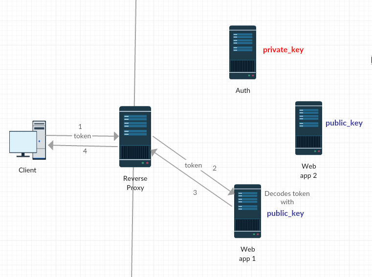

# jwtlab privatenetwork

This is a implementation of single sign on using JWT and python and RSA in a private network exposed by a reverse proxy.

The user needs a valid token to access any services from any webapps from that network. To get it, he needs to sign in with valid credentials by sending them to the auth server, like the image below.

webapp1 and webapp2 manages the user authentication by requiring a valid token within user request and by redirecting them to a login form when the token isn't valid or not sent.

The image below shows a successful access to a service from webapp1.

The network environment is implemented using the multi-machine feature from Vagrant. 

To run you need run the following command

`
vagrant up
`

This command will rise the 4 virtual servers (the proxy server, the auth server, the webapp1 server and the webapp2 server). The port exposed by the proxy server is the 8070. You can configure this and other network stuff in Vagrantfile.

